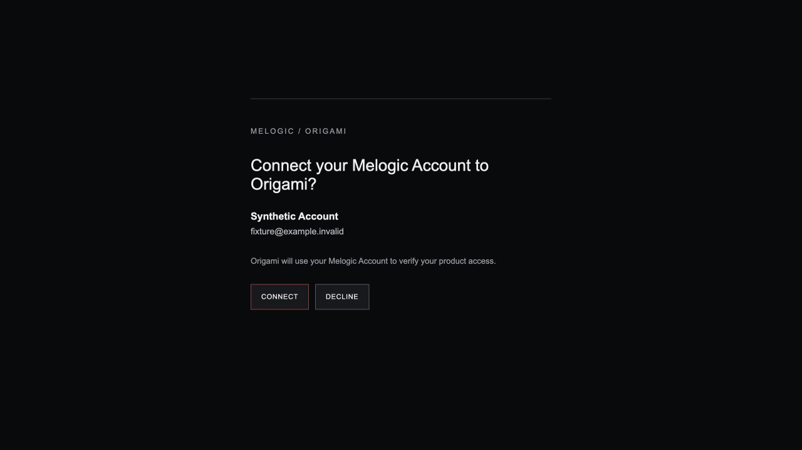
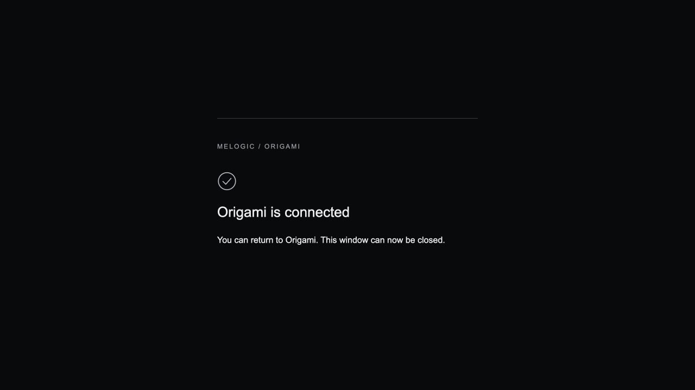
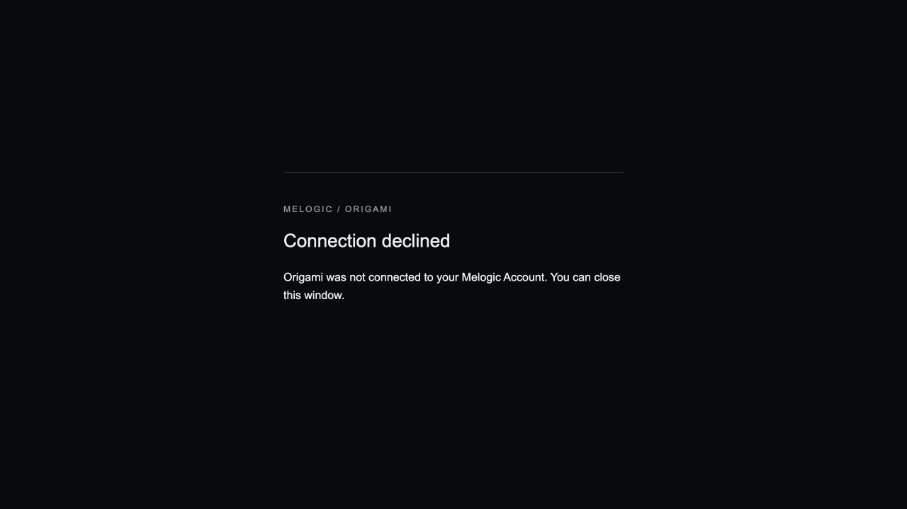
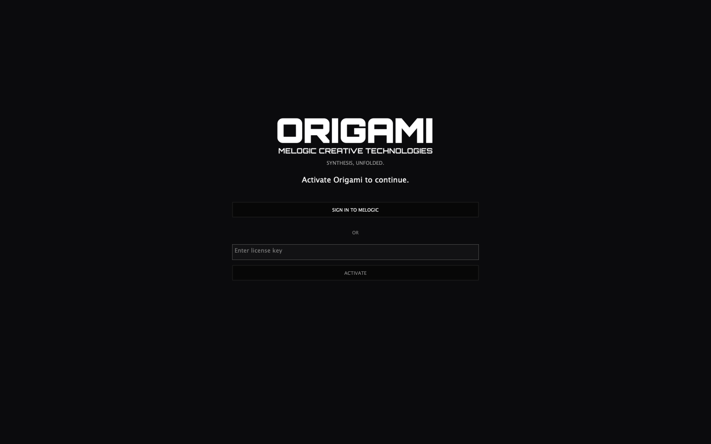
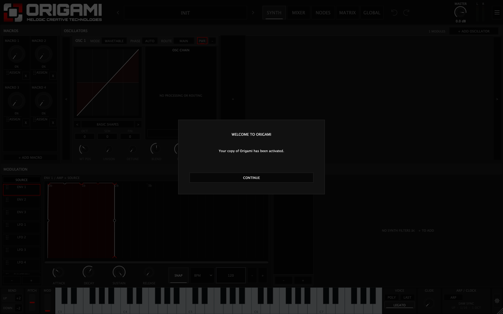
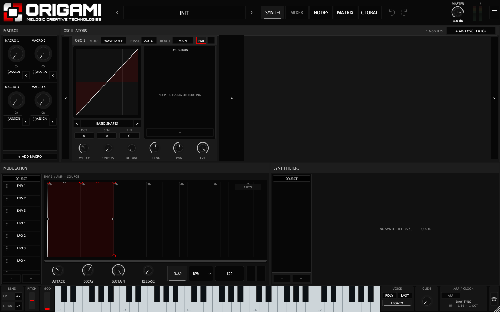
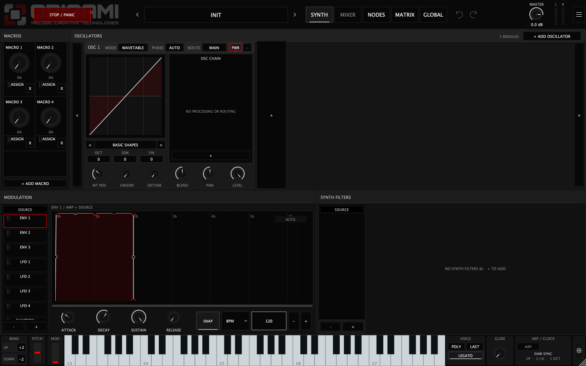

# L01.4 — consent, activation handoff and first authorized frame

## 1. Baseline

`a49afc85b1ffc1281185a2d020d977034289b0be`, current branch `mct-origami-nodes-visual-feedback-p03`. The pre-existing modified WASM metadata timestamp was preserved and excluded from this commit. No new screenshot files accompanied the L01.4 text attachment in this turn; prior supplied screenshots, the existing code, baseline QA captures and new deterministic captures informed the audit.

## 2. Existing architecture and controlling states

| Boundary | Existing authority / state |
| --- | --- |
| Key entry → Activate | Actual ActivationPanel; nonempty bounded input; no client key validity decision |
| Signed-out Activate | Editor-owned transient pendingKey; Service SignIn command / AwaitingBrowser |
| Begin → browser | Native random requestId and verifier; S256 challenge; beginDesktopLogin creates five-minute pending transaction |
| Browser account | Firebase canonical authenticated browser user, waitForInitialAuthState; signed-out browser redirects to /auth with exact return transaction |
| Consent | approveDesktopLogin validates bearer identity/revocation and core checks UID, disabled account, transaction and pending state |
| Poll | Native verifier must match stored challenge; atomic approved → consumed; only one custom token issuance |
| Account publication | Firebase custom-token exchange, account lookup, secure session save, shared SignedIn snapshot |
| Pending key continuation | Initiating panel consumes pendingKey before submitting exactly one redeem command |
| Product authorization | redeemOrigamiLicense atomically creates canonical entitlement/receipt/count and returns trusted authorization; getOrigamiAuthorization handles restore/refresh |
| Native usable state | Service publishes Authorized and opens existing authorization atomic; editor removes activation gate; audio reads that atomic |
| New welcome | Initiating panel produces UI event only after real Authorized state; shared Service claim deduplicates current command epoch; editor displays separate Welcome overlay |

Authentication is not product authorization. Browser consent creates no license or entitlement. Existing Firebase protocol, cryptography, backend transactions and session persistence are retained.

## 3. Verification-code decision

**Case A applies.** Native generates a cryptographically random 64-character transaction ID; the old short code was merely its first eight characters, uppercased. Coordinator put that prefix in Snapshot and a “Match code” message; browser independently sliced the same URL transaction ID. There is no code-entry field, manual-code comparison check or server requirement that proves a human comparison occurred. This was display guidance, not an additional protocol credential.

The actual binding is transaction ID + server-stored S256 challenge + native-held random verifier, with pending-only authenticated approval, expiration, exact request identity checks and one-time consumption. The human still gives explicit consent for the transaction opened by Origami; cryptographic binding does not eliminate phishing/social-engineering risk. No security primitive was removed. Normal browser UI no longer shows the prefix, and native progress no longer instructs an unenforced manual comparison. Internal Snapshot compatibility remains; no normal UI renders it. The URL retains the required transaction identifier; no token, verifier or key is placed there.

## 4. Consent UX

The existing desktop-auth.html, desktopAuth.js and desktopAuth.css are refined in place. The established restrained dark surface, typography, thin border and buttons remain. Normal content is MELOGIC / ORIGAMI, a connection question, canonical display name/email on separate lines, one product-access sentence, CONNECT and DECLINE. Identity uses textContent; missing name/email render gracefully, with a generic account fallback when neither exists. No account-management link, code, protocol prose or technical transaction fields appear in normal content.

## 5. Connect semantics

CONNECT sends exactly `{requestId, approve:true}` to the existing callable. Buttons disable immediately and a Connecting status appears. Only explicit `{ok:true}` completion produces the connected state. The local ready/finished guard blocks double clicks and contradictory submissions. Backend pending-only transaction validation remains the replay authority. Connection alone cannot redeem a key or grant entitlement.

## 6. Decline semantics

DECLINE sends `{requestId, approve:false}` to the same callable, then shows a final declined state only after confirmation. Backend stores cancelled; native poll learns cancelled, clears the initiating pending input and returns to recoverable activation. No token, entitlement or redemption results. Repeated decline and connect-after-decline are rejected safely by backend state validation. Decline after approved/consumed cannot undo that completed connection.

## 7. Completed browser state

Approved consent hides the entire form, identity and controls. A native SVG check mark, “Origami is connected” and “You can return to Origami. This window can now be closed.” remain. This deliberately claims account connection, not product activation. Declined consent likewise hides the form and states that Origami was not connected. Vector check visibility was verified in the browser capture, including the hidden wrapper rather than relying on an unsupported SVG hidden property.

## 8. Errors, expiry and refresh

Malformed URL requests cannot submit. Expired requests show “Connection request expired” with a return/retry instruction. Already-handled, invalid or permission-rejected requests show concise no-longer-valid copy. Other failures show an unconfirmed connection, never backend exception details. Unauthenticated sessions redirect to canonical account sign-in; revoked/disabled account enforcement remains on the server.

Refresh does not automatically replay consent or infer approval from client storage. It starts fresh UI authentication for the same URL transaction. If the user submits an already handled transaction, the backend rejects it and the page becomes terminal unavailable. No new transaction-status endpoint or client cache that claims backend approval was introduced. An approved page is not a live monitor of subsequent native redemption.

## 9. Native handoff

Original pending-key continuation is preserved. An explicit panel sign-in/Activate marks local UI activation intent. SignedIn alone cannot trigger Welcome. An unlicensed SignedIn state continues the exact pending key once; backend success publishes Authorized. Panel sync then clears pending input, TextEditor and status, and claims a Welcome event. Editor synchronizes these controls before hiding the gate or exposing the normal workspace. No second paste, Recheck, INIT reload or restart is introduced.

## 10. Legitimate authorization prerequisite

The shared welcome claim requires the existing authorization atomic to be open, shared state SignedIn and authorization state Authorized. Local activation intent is additionally required to request that claim. Native tests exercise actual Service and ActivationPanel through authenticated identity and trusted synthetic backend authorization. Invalid, expired, exhausted, revoked and network-failed redemption produce no Welcome. Browser decline/login failure produce no redemption or Welcome. An already-entitled account completing explicit activation login can welcome without consuming the pending key; a routine restore cannot.

## 11. Deduplication policy

Welcome intent/event is held only by the initiating ActivationPanel. Service stores one non-secret UI claim epoch, protected by its existing message-side mutex. It does not change entitlement, account, musical state or authorization policy. Multiple editors sharing the service cannot claim the same command epoch twice. Other editors with no activation intent simply become usable. Destroying the initiating editor discards its UI intent; there is no deferred onboarding queue for another editor to inherit.

No persistent acknowledgement file is needed: new launches, editor opens, project restoration and other plugin formats start with no activation intent. Already-existing entitlement never creates a welcome merely by restoration. Explicit new activation attempts may produce a new welcome. Separate wrapper service instances do not coordinate claims across processes, but ordinary entitlement restore still has no activation intent and therefore no Welcome. This is the smallest in-memory policy, with no credential persistence or musical-state schema changes.

## 12. Welcome and audio

Welcome is a separate sibling of activation gate and normal workspace. It uses the existing Palette, Type and themed TextButton primitives, with a centered 420 × 214 surface and restrained dimming. There is no snapshot loop, blur shader, expensive continuous blur or animation. The modal captures pointer hits; the disabled workspace and editor interaction guards block shortcuts, history actions, file drops, internal modulation drop submission and knob/history gestures. Continue removes only the UI overlay and restores workspace interaction/focus.

The legitimate audio authorization atomic remains open. Tests render nonzero authorized audio while Welcome is visible, with zero allocation/free work in the callback. Incoming host MIDI remains valid. Computer keyboard UI gestures are blocked with other synth controls during Welcome. Continue leaves patch bytes/history and authorization unchanged.

## 13. STOP / PANIC root cause

The existing Panic paint code already recomputed physical screen-pointer hover. It also revealed when cached `keyboardFocus_` was true. Its focusGained handler treated **every non-mouse focus transfer**, including direct automatic focus restoration, as deliberate keyboard intent. Hiding a focused activation overlay or restoring focus to the first button could therefore reveal Panic with the pointer elsewhere. This explains why another click/focus movement corrected it; cached hover itself was not the only reveal source.

## 14. STOP / PANIC fix

Automatic direct focus no longer counts as intentional keyboard navigation; Tab focus still reveals Panic for accessibility. A gate/access handoff explicitly clears transient Panic focus bookkeeping and gives the normal workspace a neutral focus target. Continue uses the same reconciliation. Physical hover still comes directly from current screen pointer coordinates and now requires an enabled, showing control. No arbitrary timer, delayed hiding or click-driven repair is used. Existing drag focus suppression/restoration remains covered by the full plugin suite.

## 15. First authorized frame

Panel sensitive cleanup and event consumption precede gate visibility changes. Welcome bounds, workspace enablement and overlay stacking synchronize in the same message-thread operation. Active menus, Global FX popup and any modulation/history gesture are dismissed/ended at access transitions. Panic focus is reconciled and a repaint requested before the handoff returns. Authorization loss hides Welcome and returns to the existing activation gate. Controls are re-enabled by Continue; there is no user click needed to complete normal-state initialization beyond intentionally dismissing Welcome itself.

## 16. Plaintext cleanup

Original pendingKey is consumed before redeem submission, and the entry is cleared. Final authorized sync clears pending input/entry/status again. Failure/cancel/destruction cleanup is retained. Welcome contains no identity, UID, key, digest or technical activation information. Browser never receives the license key. Test screenshots contain only synthetic account fixtures and cleared/masked native inputs; no real credentials were used or captured.

## 17. State separation / Global controls

The existing Global account controls remain unchanged. Welcome state is component memory plus a Service UI claim epoch; neither is in processor project state, preset codec, document history or DAW parameter trees. Native regression compares complete serialized project bytes/history before Welcome, blocked events, Continue and project restore. Account authentication and canonical entitlement remain backend-authoritative.

## 18. Browser tests

17 actual-document JavaScript/DOM tests cover minimal consent, safe identity with HTML-like text, missing identity fields, exact Connect/Decline payload, repeated and contradictory actions, completed/declined states, malformed success, expiry, permission/account rejection, invalid request, unauthenticated redirect, auth failure, refresh and no visible code/secret internals. Production core emulator assertions additionally cover repeated decline, connect-after-decline, decline-after-connect, expired approval, proof mismatch, UID binding, disabled/revoked accounts, independent pending transactions and absence of entitlement creation by consent.

## 19. Native activation tests

Actual JUCE controls and real Service worker cover signed-out key activation, account adoption, original key continuation once, trusted authorization, cleanup, failed login/decline, every key rejection, recoverability, already-entitled account and initiating editor destruction. The L01.3 native HTTP contract runs unchanged production backend cores against Firestore emulator and covers 22 network/storage/protocol/redemption scenarios, including the repaired slow poll and full timeout.

## 20. Welcome tests

The new actual editor integration test verifies real authorized handoff, whole-editor hit interception, mutation shortcut/drop blocking, unchanged patch/history, nonzero audio, allocation-free authorization callback, Continue, shared claim deduplication, second-editor suppression, authorization restore, reopen/project restore suppression and authorization loss. No shipping test bypass or fake authorization was added.

## 21. Hover regressions

The actual editor test places the real desktop pointer outside/inside the Panic bounds before authorization, injects stale keyboard focus while gated, then dismisses the gate without a click or post-transition pointer movement. First normal frame matches the physical location. Subsequent exit hides Panic, direct automatic focus stays hidden and explicit Tab focus retains accessibility. Existing Panic drag lifecycle tests run in the full suite. Saved pointer position is restored after the test.

## 22. RT safety

No DSP, processor callback, allocation guard or authorization atomic implementation changed. New modal/claim state is never read by processBlock. No UI, browser, HTTP, storage, Keychain, JSON, locks or joins were added to audio code. Tests verify nonzero audio under Welcome and zero callback allocations/frees; existing silent unauthorized gate, EQ and B01 tests remain intact. The independently reported Service shutdown/autorelease P0 remains open; this patch does not change its destructor or claim to fix it.

## 23. Regressions

See validation.txt for final commands/counts. Full CTest covers account, plugin UI, project/state/history, modulation/filter/FX, EQ headroom and B01 DSP torture. Final focused activation/welcome tests and browser DOM tests cover the final additions. Backend tests use only localhost Firestore emulator, synthetic tokens and disposable fixture accounts. No production mutation was performed.

## 24. Clean Release builds / installation

Standalone, AU and VST3 are built from a new tests-OFF Release tree:

```sh
cmake -S origami -B origami/build-l014-release -DCMAKE_BUILD_TYPE=Release -DJUCE_DIR=/Users/ginobarnes/Downloads/JUCE -DORIGAMI_BUILD_PLUGIN=ON -DORIGAMI_BUILD_TESTS=OFF
cmake --build origami/build-l014-release --target OrigamiPlugin_Standalone OrigamiPlugin_AU OrigamiPlugin_VST3 --parallel 4
```

Install rebuilt wrappers from `origami/build-l014-release/OrigamiPlugin_artefacts/Release/{Standalone,AU,VST3}` using the normal procedure after quitting Origami and all DAW hosts. Nothing installed was overwritten by this task. Native rebuild/install is required to test Welcome and focus repair.

## 25. Deployment scope

Production web source changes: desktop-auth.html, src/desktopAuth.js, src/styles/desktopAuth.css. Functions changes are tests only. No production Function, Firestore rule or index changed.

```sh
npm run build
firebase deploy --project melogic-records --only hosting:web
```

**Hosting only.** No Functions/rules/index deployment required. No production deployment was executed. Native installation is separately required.

## 26. Visual validation / limitations

All captures use actual application components or actual desktop-auth HTML/CSS/JS with explicit synthetic identity/callable fixtures. They are not a newly drawn mock UI. Browser/backend fixtures do not prove a production browser session or consume a real key. User production acceptance and actual DAW-host installation remain manual. Refresh intentionally revalidates on submission rather than restoring cached success. No persistent machine welcome metadata was introduced. Separate processes are not globally coordinated for simultaneous explicit new activations. The independent shutdown P0 remains open.

A. Browser consent:



B. Browser confirmed account connection:



C. Browser declined:



D. Native activation gate:



E. Authorized synth and Welcome:



F. Synth after Continue:



G. First normal frame, pointer outside Panic:


H. First normal frame, pointer inside Panic:



## 27. Commit / delivery

The commit containing this report is the L01.4 implementation commit. Resolve its immutable hash using `git log -1 --format=%H -- origami/docs/qa/licensing-l014/REPORT.md`; final delivery records the pushed hash. Only legitimate source, focused tests, docs and synthetic QA captures are committed. The pre-existing generated WASM metadata modification remains outside the commit.
