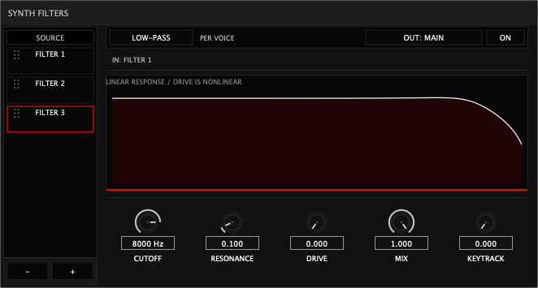
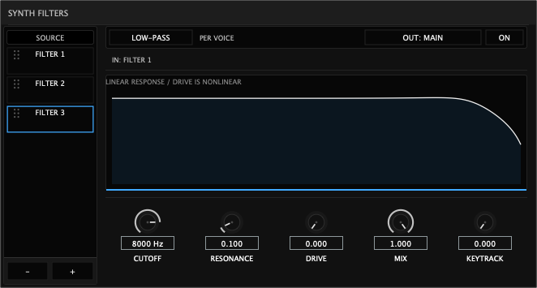
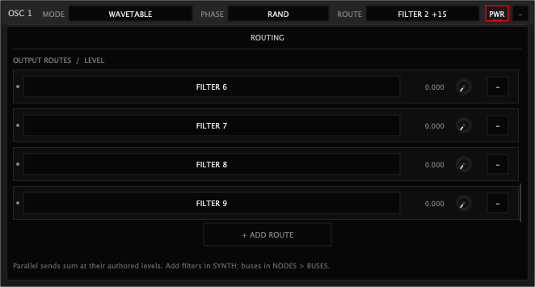

# Synth response and oscillator route mixer corrective pass

Baseline: 318feb86bca2f0f19e52e57681a67256103aa846, branch
`mct-origami-nodes-visual-feedback-p03`. No push. Measurements and the historical
fixture were captured before modifying the baseline implementation.

## 1. Existing architecture audit

Oscillators already had bounded parallel bus sends with independent levels.
Synth Filter routing added one per-oscillator FilterId edge alongside that
system. Explicit filters are independent per-voice stereo TPT low-pass runtimes;
they sum oscillator inputs once before processing. FX FilterFx uses separate
mixed-bus multimode SVF/comb runtimes. Sharing its mutable state would be wrong;
extracting and validating additional per-voice algorithms exceeds this pass.
There was no existing output-send gain smoothing to reuse. OSC CHAIN RouteAmount
modulation affects oscillator interaction amounts, not output sends; it cannot
be silently repurposed as a send-level modulation address.

## 2. Root cause of trapping

Voice took the single Synth Filter input branch and continued before rendering
oscillator bus sends. The routing editor hid send controls for an oscillator
with that filter edge, directing the user to the filter's downstream output.
Both DSP and authoring therefore enforced a single replacement destination.

## 3. Final mixer architecture

Generalize the existing `{destination ID, level}` send representation with a
Bus/Filter discriminator and sixteen fixed slots: eight buses including MAIN,
and eight Synth filters. Identity includes kind, so MAIN BusId 1 and FilterId 1
remain distinct. Gains are finite, bounded 0–1; destination duplicates reject.
The canonical effective accessor `oscillatorOutputRouting` inherits historical
module bus sends until an output override is authored. Authoring writes the
existing SynthFilterInput override array, now typed, into the same modulation
mailbox as filter topology. This avoids publishing a route and its filter via
independent mailboxes. UI controls read/write that canonical representation.

Writer preparation resolves every stable ID to fixed bus/filter slots and
orders the bounded serial stages. Voice performs indexed fan-out, without ID
lookup or dynamic collections. A filter processes its summed input once per
voice/sample even when shared by multiple oscillators. Rows show destinations,
three-decimal levels, active/inactive accent dots, knobs, and remove controls.
A native destination picker offers only existing, nonduplicate buses/filters.
The sixteen-row list scrolls inside the existing oscillator routing workspace.
The last authored destination cannot be removed, but its gain may be zero.

## 4. Drag/drop

Filter→OSC and OSC→Filter invoke the same canonical exclusive preset: selected
filter gain becomes 1; every other authored oscillator send becomes 0. Existing
rows remain editable. The filter's own OUT destination never changes as a
side effect. If capacity prevents adding a missing destination, the command
rejects atomically. Filter→Filter remains the explicit safe AFTER operation.
Add Route is different: append a selected destination at zero, preserving all
other gains.

## 5. Parallel summing

The oscillator's existing post-envelope, post-implicit-filter, level/pan signal
fans out to each destination multiplied exactly once by its authored gain.
MAIN 0.25 + Filter1 1 + Bus2 0.5 produces that dry MAIN path, unity filter input,
and an independent half-level dry Bus2 path. No send normalization is added.
The existing final oscillator/voice normalization and downstream master/FX
behavior remain. Full-unity sends can therefore raise the combined level.

## 6. Filter outputs and chains

Filter OUT keeps the existing deterministic next-filter or terminal bus-send
semantics. OSC dry sends remain independent of the chain. Explicit AFTER
insertion preserves downstream destinations. Deleting a serial intermediate
splices upstream filter outputs to its downstream destination. Deleting an
oscillator's routed filter removes that send; positive remaining send gains
are untouched. MAIN is restored at unity only when no positive sends remain.
Filter IDs remain monotonic and are never retargeted to newly created filters.

## 7. Type selector

The LOW-PASS header is an actual native choice menu with LOW-PASS as its sole
enabled, selected choice. It corresponds to the implemented per-voice TPT
low-pass; no decorative multimode types are offered. No extra DSP type/state
field is needed while only one algorithm exists. FX algorithms and runtimes
remain independent. Further types require a validated Synth implementation.

## 8. Response and parameters

The white response derives from actual low-pass coefficients, mix and observed
per-voice values, including effective keytracking/modulation. A separate copy
of that curve closes down to the plot floor and fills with ENV's
`signalSurfaceColour(.46f,.22f)` token. The white stroke is independent;
no whole-graph tint, hardcoded red, artificial animation or audio-thread FFT
was added. Automated pixel checks cover above/below curve theme behavior,
fill reaching the floor, and observed cutoff moving both the coefficient-based
stroke and fill. Cutoff displays `8000 Hz` / `20.0 kHz`, accepts kHz text, and
canonical knob double-click reset and modulation assignment remain intact.

## 9. State/schema

Typed overrides select v37. Each route serializes stable ID, float gain and
bounded kind word. v37 rejects nonzero legacy filter edges, unsupported kinds,
duplicate/dangling destinations, invalid gains, cycles and truncated state.
Decoder limits stay eight sends for historical versions and sixteen for v37.
Mixed old in-memory edges and typed authoring serialize canonically into v37.
v36 single edges decode as unity Filter sends with no direct bus send, retaining
filter OUT and chain state. Direct old patches inherit their existing bus sends.
Atomic decoder rejection remains. Init/older patches keep their older schema
when they contain no new authoring.

The actual v36 binary and raw audio fixture were generated with the baseline
engine before editing. All 8192 stereo samples of its sixteen-block serial
render match after migration within 1e-6. All 21 comparable benchmark hashes
also remain identical.

## 10. Files changed

- Core: BusModel.cpp, Engine.cpp, InstrumentState.cpp, OscillatorModule.h,
  OscillatorRenderPlan.h, SynthFilter.h, Voice.cpp.
- Modulation: modulation/Modulation.cpp and Modulation.h (canonical effective
  sends, commands, validation/preparation, updated fixed frame size guard).
- State: preset/StateCodec.cpp.
- UI: plugin/ui/OscillatorRack.cpp/.h, SignalPanels.cpp/.h.
- Tests: EngineTests.cpp, StateTests.cpp, PluginTests.cpp, PerfBench.cpp,
  FxGraphTests.cpp (measured fixed-capacity footprint gates).
- Evidence: tests/fixtures historical binary/audio and provenance README;
  this report, screenshots, before/after memory and performance records.

## 11. Tests and counters

All seven suites pass. Final exact counters: State 2,744; Engine 578,536;
Modulation 3,938; FX graph/DSP/bus 648; Plugin/UI 1,607,760; Content 98;
Wavetable foundation PASS (no numeric counter). The numeric suites total
2,193,724 checks. Full CTest passed 7/7; after the final codec edge-case fix,
rebuild-dev reran Engine/Plugin/FX/Content and targeted CTest reran the remaining
State/Modulation/Wavetable suites against the final binaries. The complete
`./origami/scripts/rebuild-dev.sh` deployed Standalone/AU/VST3 successfully;
`auval -v aumu Orig Mctg` reported AU VALIDATION SUCCEEDED.
Coverage includes actual historical decode/audio, INIT and exclusive drop,
neutral addition, independent MAIN/filter/bus output, dry plus serial chain,
exact gains after roundtrip, deletion fallback/preservation, stable IDs,
bounded/corrupt state, type choices, cutoff units/reset/assignment, truthful
response/fill/theme, sixteen-route scroll reachability, and guarded RT adoption.
No test retained the superseded prepend-on-drop or trapped-OSC expectations.

## 12. Realtime audit

Prepared fixed plans and canonical modulation publication remain lock-free on
the audio side. No heap collection, mutex, per-sample identity lookup, graph
sort or FFT is introduced. Existing allocation/free interception checks cover
render, prepared route gain adoption, held gain changes and Panic/reset: zero
allocations and zero frees. Gain targets are published with topology; one shared
5 ms linear ramp advances once per engine sample, independent of voice count.
It changes fixed per-oscillator bus/filter gain vectors. No sounding envelope
means snap to saved gains, preventing new-note or migrated-patch fade-in.
The held bus-send test checks each sample against the exact 240-sample ramp at
48 kHz. Existing maximum-filter, sixteen-voice, mono/legato and stable runtime
slot reorder tests remain.

## 13. Memory/performance

Fixed KiB before → after: processor 2638.6 → 2763.6; engine 2389.3 → 2489.4;
Voice 127.6 → 131.6 (sixteen voices 2041 → 2105); ModulationState 22.1 → 25.1;
ModulationFrame 9.9 → 11.9; OscillatorRenderPlan 6.4 → 7.5. Exact bytes:
OscillatorModuleState 504 → 632; SynthFilterPlan 920 → 1444;
SynthFilterCollection 2020 → 5092. SynthFilterRuntime stays 112 bytes per filter
per voice; no new heap-owned DSP buffers. The measured Voice/Engine gates are
132/2496 KiB. Growth comes from bounded typed sends, oscillator snapshots,
compiled vectors and publication storage; spectral cache/wavetable memory is
unchanged.

Benchmarks use 48 kHz, 256 frames, 1/8/16 voices. Seven new scenarios include
maximum 16 oscillators × sixteen sends (eight buses/eight filters). Raw records
are `performance-before.txt` / `performance-after.txt`; timing is a local
workstation observation, not a statistically controlled cross-machine claim.
The zero-filter compile-time render specialization remains. Comparable Init
medians are 16.8→17.8, 61.2→61.7 and 109.8→109.2 µs. Shared four-OSC filter cost
at sixteen voices increases 304.5→345.3 µs (+13.4%); expanded bounded fan-out
has a cost. Maximum new routing is 1477.0 µs median / 1513.1 µs p99, or
27.69% / 28.37% of the callback budget. All measured benchmark rows report zero
spectral misses, requests and node compiles during rendering. The complete
seven-scenario timing table is in `benchmark-tables.md`.

## 14. Exact manual QA checklist

These are human QA instructions; automated rendering/audio checks do not claim
that an interactive listening session has been completed.

1. Load Init in the rebuilt Standalone or DAW; open OSC1 ROUTE and verify MAIN 1.000.
2. Add Filter1 in SYNTH FILTERS and verify its OUT is MAIN.
3. Drag Filter1 onto OSC1 (then repeat OSC1 onto Filter1 to check the reverse gesture).
4. Confirm Filter1 1.000 and MAIN 0.000; verify Filter1 OUT did not change.
5. Open OSC1 ROUTE and inspect destination rows, level knobs, numbers and active dots.
6. Raise MAIN to 0.250 while keeping Filter1 at 1.000.
7. Hold a note; lower Filter1 cutoff and hear the dry signal alongside the filtered signal.
8. Create BUS2 in NODES > BUSES; use + ADD ROUTE to select it. Confirm it starts at 0.000 and existing gains are unchanged; raise it to 0.500.
9. Change each level during a held note; verify continuous fades and independent paths. Add enough destinations to scroll to the final route.
10. Save and reload the patch; verify exact MAIN/Filter1/BUS2 gains and Filter OUT.
11. Delete Filter1 with MAIN/BUS2 active; verify those gains remain. Repeat with a filter-only oscillator and confirm MAIN restores to unity.
12. Confirm the deleted filter row/modulation destination disappears; add another filter and verify it gets a new identity.
13. Inspect the response: light curve, translucent accent beneath it, fill reaching the floor, and untinted area above it.
14. Sweep cutoff/resonance and mix; verify the curve and fill remain coherent and stable. Check Hz/kHz display and double-click cutoff reset to 8000 Hz.
15. Assign ENV/LFO to cutoff, hold a note, and verify observed curve and fill move together; verify knob modulation assignment still targets the selected FilterId.
16. Change the signal theme accent; verify fill changes with it and the response stroke remains light.
17. Open LOW-PASS's type dropdown. Verify LOW-PASS is the only enabled choice and uses the actual TPT low-pass response/audio; unsupported types are absent.

## 15. Known limitations

Additional Synth filter types and output-route level modulation are deferred.
The fixed typed ID/gain records support future destination addressing without
rewriting gain storage. Gains smooth; topology removal, filter deletion and
identity replacement retain deterministic immediate lifecycle semantics rather
than crossfading deleted runtimes. Zero-gain authored filter routes remain
prepared to support gain fades and therefore can consume DSP work. Filter OUT
is still deterministic serial/terminal routing, not an arbitrary parallel graph.
Existing nonlinear drive aliasing/response annotation remains unchanged.

## 16. Commit

The exact implementation commit SHA is returned in the final response. The
commit includes this report and evidence. No push or subsequent feature work.
